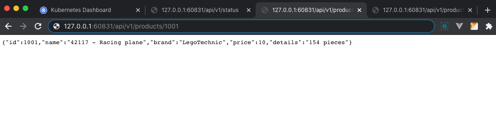

# SimpleApi (Docker, Kubernetes (minikube))

**Дисциплина:** "Технологии разработки программного обеспечения"

**Лабораторная работа №2:** создание кластера Kubernetes и деплой приложения

**Выполнил:** Шабанов Александр (МБД2032)

**Цель работы:** знакомство с кластерной архитектурой на примере Kubernetes, а также деплой приложения в кластер.

---
**Для деплоя приложения использовались следующие манифесты:**

deployment.yaml:
`    apiVersion: apps/v1  
    kind: Deployment  
    metadata:  
      name: my-deployment  
    spec:  
      replicas: 10  
      selector:  
        matchLabels:  
          app: my-app  
      strategy:  
        rollingUpdate:  
          maxSurge: 1  
          maxUnavailable: 1  
        type: RollingUpdate  
      template:  
        metadata:  
          labels:  
            app: my-app  
        spec:  
          containers:  
            - image: myapi:latest  
              imagePullPolicy: Never   
              name: myapi  
              ports:  
                - containerPort: 8080  
          hostAliases:  
          - ip: "127.0.0.1"  
            hostnames:  
            - postgres.local`

service.yaml:
`   apiVersion: v1  
    kind: Service  
    metadata:  
      name: my-service  
    spec:  
      type: NodePort  
      ports:  
        - nodePort: 31317  
          port: 8080  
          protocol: TCP  
          targetPort: 8080  
      selector:  
        app: my-app`

**Dashboard UI:**

**Terminal:**

**Endpoints:**

[Видео обзор на деплой в кластер minikube](https://drive.google.com/file/d/1uqj94raamNxUSu3wIxXjIHt-TAE3VlMj/view?usp=sharing)
